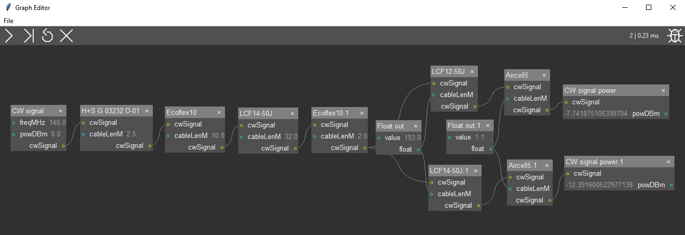

# RF Link Nodes
Package with nodes for link budget calculations for RF signals.

## Description
This is an external node package for the [Flow](https://github.com/EMS-TU-Ilmenau/Flow) project. 



## How to use
1. Install [Flow](https://github.com/EMS-TU-Ilmenau/Flow)
2. Clone this repository and 
    - either run `python start_gui.py` locally, 
    - or install this package via `pip install .` to use it globally
3. As mentioned in the description of *Flow*, right-click on the canvas in the GUI to spawn nodes from the *linkbudget* menu. 

When not used with the GUI and not installed, make sure to import it locally, e.g. with
```python
from flow import Graph
graph = Graph()
graph.scopeNodePkg('path/to/linkbudget') # import this node package
graph.addNode(graph.nodeFromDatabase('linkbudget.FreespaceLoss'))
print(graph)
print(graph.process()[0])
```
